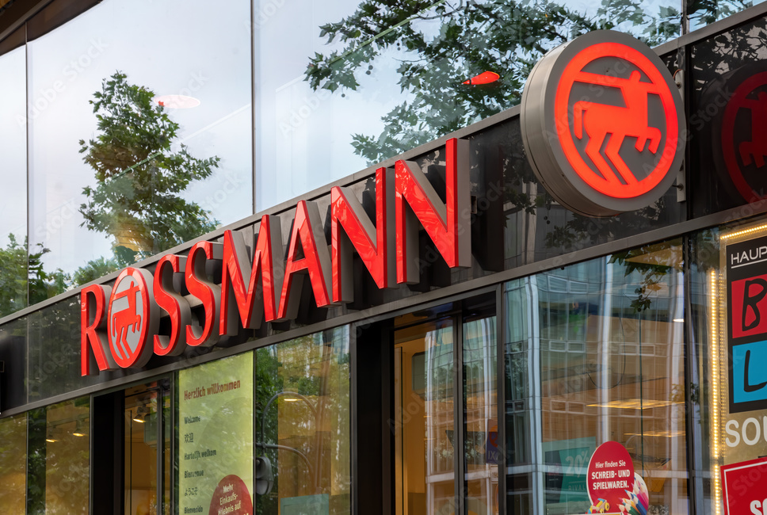
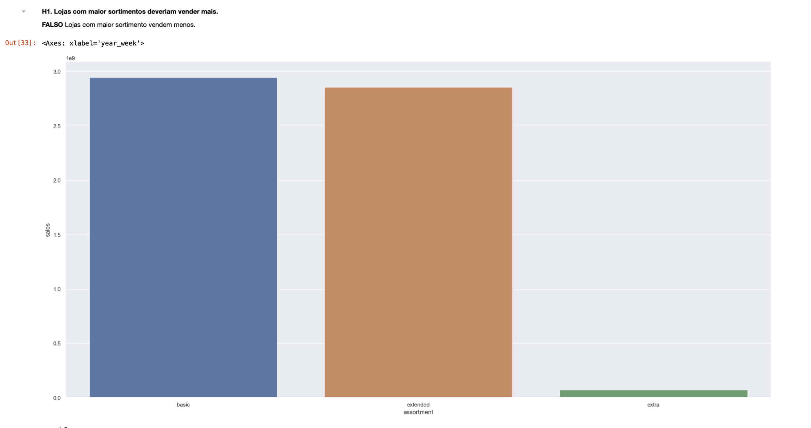
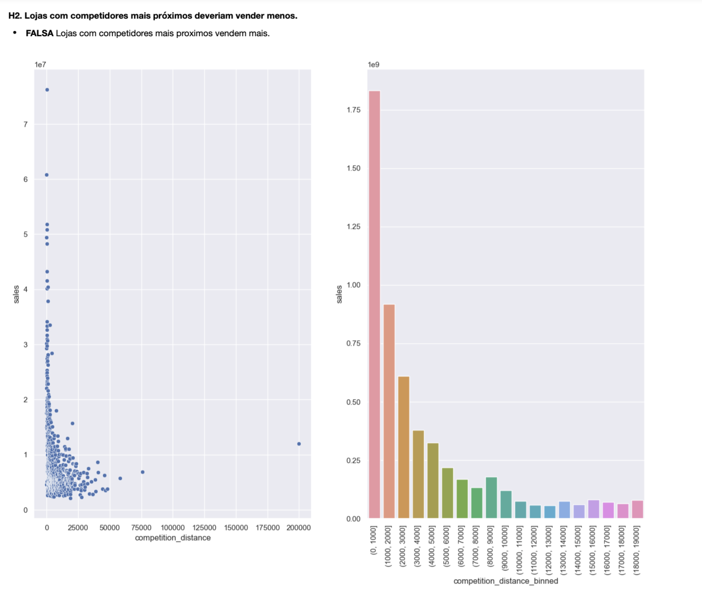
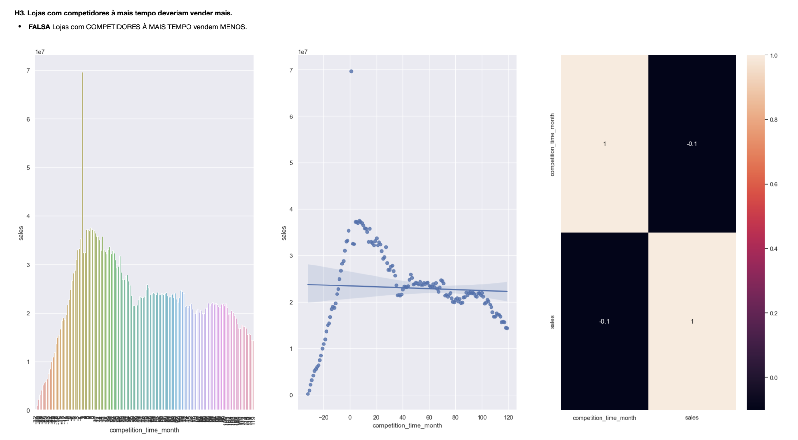
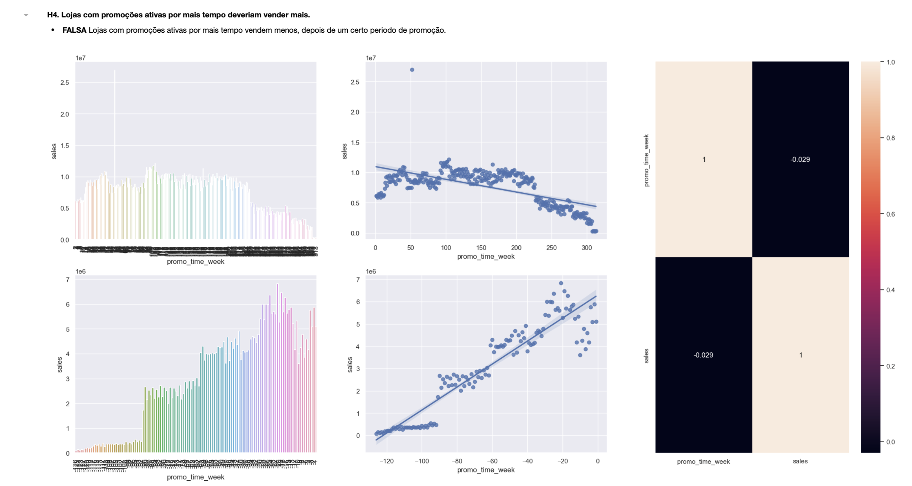
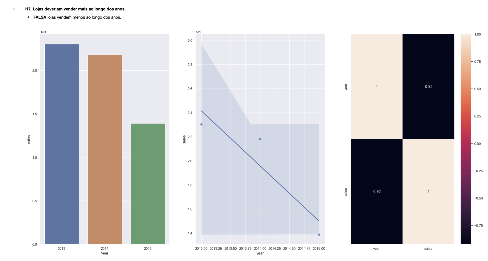
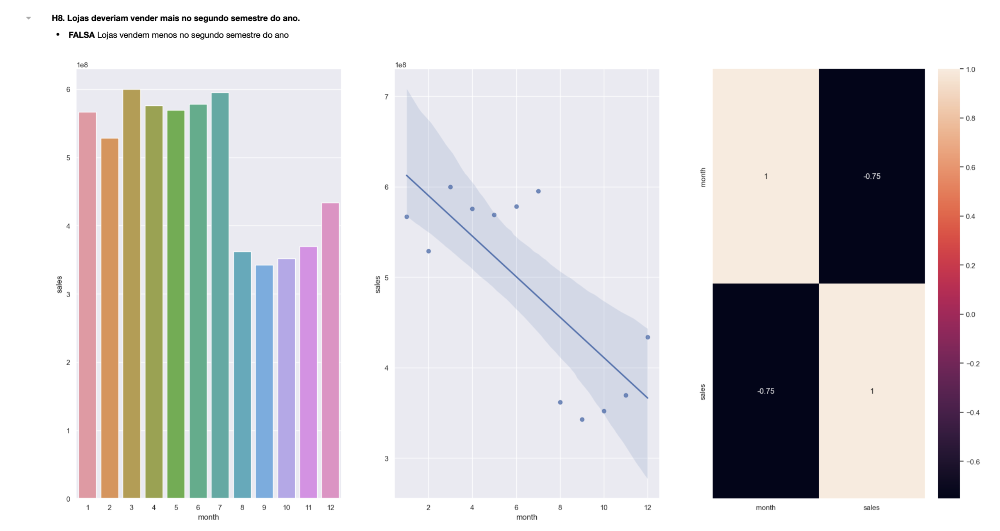
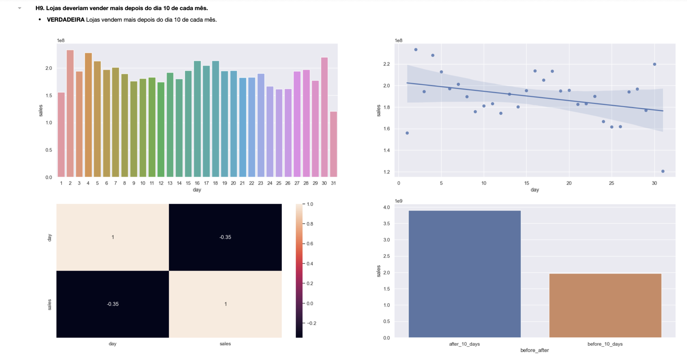
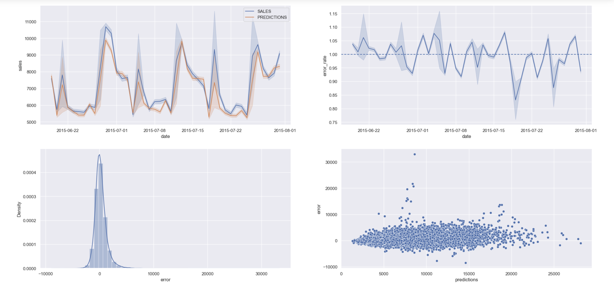

#  Sales Prediction - Rossmann Drugstore
 

 A Dirk Rossmann GmbH, comumente referida como Rossmann, é uma das maiores redes de drogarias da Europa, com cerca de 56.200 funcionários e mais de 4.000 lojas.

 A rede de farmacias disponibilizou seus dados atráves do site [Kaggle](https://www.kaggle.com/competitions/rossmann-store-sales/overview). Foram disponibilizados 1.017.209 registros das vendas realizadas pelas filias da empresa, contendo 18 características únicas para cada venda realizada.

 # 1. Problema de Negócio
O objetivo deste projeto é desenvolver um sistema automatizado para prever as receitas das lojas da rede de farmácias, a fim de auxiliar o CFO na decisão de reformar as lojas. Atualmente, as previsões são feitas manualmente pelos gerentes de cada loja, levando em conta fatores como promoções, competição por clientes, feriados e sazonalidade. No entanto, os resultados dessas previsões variam muito devido à abordagem manual e às particularidades de cada loja.

Para resolver esse problema, propõe-se a criação de um sistema que utilize técnicas de análise de dados e aprendizado de máquina para processar informações históricas das lojas, como vendas passadas, promoções realizadas e dados sobre concorrentes. Com base nesses dados, o sistema gerará previsões automatizadas de receita para as próximas 6 semanas de cada loja.

Para facilitar o acesso e consulta dessas previsões, será desenvolvido um Bot no aplicativo Telegram. O CFO poderá utilizar esse Bot para consultar as previsões de receita de forma conveniente e intuitiva, permitindo uma análise mais eficiente e embasada na tomada de decisão em relação ao investimento na reforma de cada loja.

Com a implementação desse sistema automatizado, espera-se que o CFO tenha acesso a previsões mais precisas e confiáveis, o que auxiliará na definição dos recursos a serem investidos em cada loja. Dessa forma, será possível melhorar a estrutura das lojas, oferecer um melhor atendimento ao público e impulsionar o sucesso da rede de farmácias.

 # 2. Premissas de Negócio
 Para a construção da solução, foram consideradas as seguintes premissas:
 * A consulta da previsão de vendas estará disponível 24/7, e será acessível via aplicativo do Telegram, onde o CFO digitará o código da loja, e como resposta, receberá o valor da previsão para as próximas 6 semanas.
 * Foram consideradas para a previsão apenas as lojas que possuiam o valor de vendas superior a 0 na base de dados.
 * Os dias em que as lojas estavam fechadas foram descartadas na realização da previsão.
 * Lojas que não possuíam dados de competidores próximos tiveram o valor da distância fixada em 200.000 metros.

 ## 2.1. Descrição dos Dados
 | Atributo                          | Descrição                                                                                                                                             |
 | :-------------------------------- | :---------------------------------------------------------------------------------------------------------------------------------------------------- |
 | Store                             | Identificador único de cada loja                                                                                                                      |
 | Date                              | Data em que ocorreu o evento de venda                                                                                                                 |
 | DayOfWeek                         | Variável numérica que representa o dia da semana                                                                                                      |
 | Sales                             | Valor de vendas do dia                                                                                                                                |
 | Customers                         | Quantidade de clientes na loja no dia                                                                                                                 |
 | Open                              | Indicador para loja aberta = 1 ou fechada = 0                                                                                                         |
 | StateHoliday                      | Indica se o dia é feriado de estado. a = Feriado público, b = Feriado de páscoa, c = Natal, 0 = Não há feriado                                        |
 | SchoolHoliday                     | Indica se a loja foi ou não fechada durante o feriado escolar                                                                                         |
 | StoreType                         | Indica o modelo de lojas. Pode variar entre a, b, c, d                                                                                                |
 | Assortment                        | Indica o nível de variedade de produtos: a = básico, b = extra, c = estendido                                                                         |
 | CompetitionDistance               | Distância (em metros) para o competidor mais próximo                                                                                                  |
 | CompetitionOpenSince [Month/Year] | Indica o ano e mês em que o competidor mais próximo abriu                                                                                             |
 | Promo                             | Indica se a loja está com alguma promoção ativa no dia                                                                                                |
 | Promo2                            | Indica se a loja deu continuidade na promoção: 0 = loja não está participando, 1 = loja participando                                                  |
 | Promo2Since [Year/Week]           | Descreve o ano e semana de quando a loja começa a a promoção extendida                                                                                |
 | PromoInterval                     | Descreve os meses em que a loja iniciou a promo2, ex.: "Feb,May,Aug,Nov" significa que a loja iniciou as promoções estendidas em cada um desses meses |

 # 3. Estratégia da Solução
 Para fazer a entrega da primeira solução de maneira o mais rápido possível, entregando valor para a empresa e possibilitando que o CFO tome decisões com mais agilidade, foi utilizado o método CRISP-DS
 

**Passos do CRISP-DS**:

O método CRISP-DS consiste em nove passos cíclicos para desenvolver uma solução de forma iterativa e com entregas rápidas e de qualidade. Os passos são:

**1. Problema de Negócio:** Nesta etapa, o objetivo é receber e compreender o problema de negócio que será abordado. É fundamental entender as perguntas e necessidades do cliente ou dono do problema.

**2. Entendimento de Negócio:** Nesta etapa, busca-se obter uma visão mais aprofundada do problema e das necessidades do cliente. Protótipos e validações podem ser utilizados para assegurar o alinhamento com o cliente.

**3. Coleta de Dados:** Aqui, os dados relevantes para a solução foram coletados no site do Kaggle.

**4. Limpeza dos Dados:** Nesta etapa, os dados são preparados e tratados para garantir sua qualidade e consistência. Dados ausentes, inconsistentes ou incorretos são tratados adequadamente.

**5. Exploração dos Dados:** O objetivo é analisar os dados coletados e identificar padrões, tendências e insights relevantes. Visualizações e análises estatísticas são aplicadas para entender melhor os dados.

**6. Modelagem dos Dados:** Nesta etapa, os dados são transformados e preparados para serem utilizados por algoritmos de Machine Learning. Variáveis de entrada e saída são definidas e modelos são treinados e validados.

**7. Aplicação de Algoritmos de Machine Learning:** Aqui, os modelos treinados são aplicados aos dados para gerar resultados e previsões. O desempenho dos modelos é monitorado e ajustes podem ser realizados.

**8. Avaliação de Performance:** Nesta etapa, a performance dos modelos é avaliada em relação aos objetivos de negócio estabelecidos. Os resultados são comparados com métricas de referência ou outras abordagens existentes.

**9. Publicação da Solução:** Por fim, a solução é documentada, apresentada e disponibilizada para uso. Os resultados são comunicados ao cliente ou stakeholders relevantes.

Esse ciclo se repete, permitindo melhorias contínuas com base no feedback e na validação dos resultados.

 ## 3.1. Produto Final
 Foi combinado com o CFO que seria entregue um Bot dentro do aplicativo Telegram, facilitando assim que o CFO verifique a previsão das lojas independente do local em que ele esteja.

 Além disso, no processo de criação do produto final, será criado uma API que será utilizada para retornar as previsões das lojas. Essa API irá utilizar o modelo de Machine Learning desenvolvido para realizar a previsão.

 ## 3.2. Ferramentas Utilizadas
 Para criar a solução, foram utilizadas as seguintes ferramentas:
 - Linguagem de Programação Python versão 3.10.9
 - Versionador de código Git
 - Aplicação Jupyter Notebook para prototipar a solução
 - Serviço de Hospedagem em Nuvem Render
 - Técnicas de manipulação de dados utilizando a linguagem de programação Python
 - Técnicas de redução de dimensionalidade e seleção de atributos utilizando Boruta
 - Algoritmos de Machine Learning da biblioteca [scikit-learn](https://scikit-learn.org/stable/) da linguagem de programação Python

 # 4. Insights de Negócio
 Foi criado um Mindmap para ajudar na construção de Hipóteses, a fim de facilitar e delimitar o escopo da etapa de análise exploratória.

 

 Através desse Mindmap, foram geradas 12 hipóteses de negócio, das quais 11 foram escolhidas para serem validadas, confirmando assim premissas da equipe de negócios e do CEO, além da geração de insights para ambos.

 Dessas 11 hipóteses verificadas, os principais insights gerados foram:

 ## Insight 1: Lojas com maior sortimento deveriam vender MAIS.
 **Hipótese FALSA:** Lojas com maior sortimento vendem MENOS.

 

 ## Insight 2: Lojas com competidores mais próximos deveriam vender MENOS.
 **Hipótese FALSA:** Lojas com competidores mais próximos vendem MAIS.

 

 ## Insight 3: Lojas com competidores à mais tempo deveriam vender MAIS.
 **Hipótese FALSA:** Lojas com competidores à mais tempo vendem MENOS.

 

 ## Insight 4: Lojas com promoções ativas por mais tempo deveriam vender MAIS.
 **Hipótese FALSA:** Lojas com promoções ativas por mais tempo vendem MENOS, depois de um certo periodo.

 

 ## Insight 5: Lojas deveriam vender MAIS ao longo dos anos.
 **Hipótese FALSA:** Lojas vendem MENOS ao longo dos anos.

 

 ## Insight 6: Lojas deveriam vender MAIS no segundo semestre do ano.
 **Hipótese FALSA:** Lojas vendem MENOS no segundo semestre do ano.

 

 ## Insight 7: Lojas deveriam vender MAIS depois do dia 10 de cada mês.
 **Hipótese VERDADEIRA:** Lojas vendem mais depois do dia 10 de cada mês.

 
 

 # 5. Modelos de Machine Learning
 No primeiro ciclo do projeto, foram escolhidos 5 algoritmos para teste, com o objetivo de identificar o algoritmo que apresentasse a melhor performance e o melhor custo de implementação. Nesta etapa inicial, priorizou-se a simplicidade, levando em consideração que era o primeiro ciclo do projeto. O foco principal era entregar uma solução que fosse utilizável pela equipe de negócios e pelo CFO.

 Os algotitmos selecionados foram:
 - Avarege Model
 - Linear Regression
 - Linear Regression - Lasso
 - Random Forest Regressor
 - XGBRegressor

 Após a escolha dos algoritmos, foram realizados treinamentos e testes com cada um deles, a fim de verificar qual deles teria a melhor perfomance.

 Além disso, foi utilizado o método de seleção de *features* [Boruta](https://mbq.github.io/Boruta/) para auxiliar na escolha das *features* mais importantes e impactantes da base de dados.

 # 6. Seleção do Modelo de Machine Learning
 ## 6.1. Escolha da Métrica
 Foi utilizado a métrica ***MAPE (Mean Absolute Percentage Error)*** como parâmetro de escolha entre os algoritmos, porque esta métrica é mais fácil de ser compreendida pela equipe de negócio e pelo CEO, visto que ela representa a porcentagem do erro em relação ao valor médio.

 ## 6.2. Métricas dos Algoritmos
 Após os testes inicias, obtivemos os seguintes resultados:

 | Nome do Modelo            |         MAE |     MAPE |        RMSE |
 | :------------------------ | ----------: | -------: | ----------: |
 | Average Model             | 1354.800353	| 0.206400	| 1835.135542 |
 | Linear Regression         | 1877.198155	| 0.285382	| 2714.358897 |
 | Linear Regression - Lasso | 1904.239040 |	0.288496	| 2770.057056 |
 | Random Forest Regressor   |  647.804423	| 0.095993	|  955.352596 |
 | XGBRegressor              | 6685.063278 |	0.949708	| 7332.136890 |

 ## 6.3. Métricas dos Algoritmos - *Cross Validation*
 Após os testes com os algoritmos selecionados, foi utilizado a técnica de ***Cross Validation*** para validar os resultados e garantir a performance real de cada uma dos modelo utilizados. Como o problema se tratava de um série temporal, foi utilizada a técnica de ***Cross Validation*** específica para esse problema, respeitando assim a linha do tempo no treinamento dos algoritmos.

 Com esse método de validação, foram obtidas as seguintes performances:

 | Nome do Modelo                |             MAE CV |       MAPE CV |            RMSE CV |
 | :---------------------------- | -----------------: | ------------: | -----------------: |
 | Linear Regression             |  2062.69 +/- 266.2 |  0.3 +/- 0.01 | 	2939.3 +/- 394.32 |
 | Linear Regression Lasso       | 2132.56 +/- 342.07	| 0.29 +/- 0.01	| 3078.23 +/- 504.69 |
 | Random Forest Regressor       |   887.1 +/- 248.38	| 0.13 +/- 0.03	| 1305.83 +/- 350.92 |
 | XGBoost Regressor             | 7049.55 +/- 589.23	|  0.95 +/- 0.0	| 7715.97 +/- 690.19 |

 ## 6.4. Escolha do Modelo
 Embora o algoritmo ***Random Forest Regressor*** tenha sido o algoritmo que melhor performou, foi optado pela escolha do algoritmo ***XGBoost Regressor*** nesta etapa. 
 - Primeiro, porque o erro entre esses dois algoritmos é pequeno.
 - Segundo, porque o tempo de treinamento do ***XGBoost Regressor*** é mais rápido se comparado ao algoritmo ***Random Forest Regressor***. 
 - Terceiro, porque o modelo final treinado pelo algoritmo ***XGBoost Regressor*** ocupa menos espaço que o algoritmo ***Random Forest Regressor***, deixando assim o uso de servidores em nuvem mais baratos.

 ## 6.5. Ajuste de Hiperparâmetros
 Foi o utilizado a técnica de ***Random Search*** para fazer a busca dos melhores hyperparâmetros. Os seguintes parâmetros foram escolhidos pelo Random Search:

 | N_Estimators | eta | max_depth | subsample | colsample_bytree | min_child_weight |
 | :----------: | --: | --------: | --------: | ---------------: | ---------------: |
 |     3000     | 0.03|         5 |       0.7 |              0.7 |                3 |

 ## 6.6. Performance do Modelo
 Como podemos observar, o modelo selecionado obteve uma performance aceitável, visto que conseguiu entender e reproduzir o padrão de vendas ao longo dos anos estudados.

 | Nome do Modelo                |                MAE |          MAPE |               RMSE |
 | :---------------------------- | -----------------: | ------------: | -----------------: |
 | XGBoost Regressor             |         789.776765 |      0.116032 |        1159.851143 |

 Já nos dois últimos gráficos, podemos observar uma distribuição normal a cerca das previsões, o que nos inidica um bom resultado do modelo selecionado, além de podermos verificar a distribuição dos erros do modelo.

 

 # 7. Resultado de Negócio
 Com o modelo selecionado e treinado, obtivemos a seguinte performance de negócio para as 5 melhores lojas:
 

 | ID da Loja |     Previsões |  Pior Cenário | Melhor Cenário |         MAE |     MAPE |
 | :--------- | ------------: | ------------: | -------------: | ----------: | -------: |
 |        733	|  630917.43750	| 630243.330101 |  631591.544899	|  674.107399	| 0.045766 |
 |	       259	|  547512.87500	| 546918.842024	|  548106.907976	|  594.032976	| 0.047181 |
	|        763	|  232939.84375	| 232629.126874	|  233250.560626	|  310.716876	| 0.050990 |
	|        667	|  314187.06250	| 313680.551758	|  314693.573242	|  506.510742	| 0.056180 |
	|        615	|  336742.81250	| 336204.028188	|  337281.596812	|  538.784312	| 0.058329 |

 Um ponto importante de ressaltar, é que houveram algumas lojas que não obtiveram bons resultados, e que em uma próxima iteração deve ser tratadas individualmente para verificar qual pode ser o problema para essas lojas. As 5 piores lojas tiveram a seguinte performance:

| ID da Loja |     Previsões |  Pior Cenário | Melhor Cenário |         MAE |      MAPE |
 | :--------- | ------------: | ------------: | -------------: | ---------:  | --------: |
 |	       292 | 105322.515625	| 101931.758416	|  108713.272834	| 3390.757209 |	 0.578537 |
 |	       909 |	220784.703125 | 212960.640094	|  228608.766156	| 7824.063031	|  0.509974 |
 |	       170 | 213355.031250	| 211695.489977	|  215014.572523	| 1659.541273	|  0.412707 |
 |	       902	| 206358.625000	| 204778.878563	|  207938.371437	| 1579.746437	|  0.394516 |
 |	       876	| 189482.875000	| 185219.550187	|  193746.199813	| 4263.324813 |  0.351492 |

 Como resultado final, temos os seguintes cenários:

 | Cenários           |           Valores |
 | :----------------- | ----------------: |
 | Previsão Realizada |   $280,109,376.00 |
 | Pior Cenário       |   $279,226,326.62 |
 | Melhor Cenário     |   $280,992,375.07 |

 # 8. Conclusões
 Conforme pôde ser verificado, o projeto resolveu o problema inicial, que era a previsão de faturamento das lojas feitas de forma manual por seus gerentes.

 Outro ponto importante de destacar é que com a solução criada, o CFO pode agora consultar as lojas de forma automática utilizando o BOT criado, dando mais  agilidade na tomada de decisão.

 # 9. Lições Aprendidas
 * Priorizar tarefas e soluções
 * Desenvolver soluções de forma cíclica, entregando assim resultado mais rapidamente
 * Construção de um BOT para o aplicativo de mensagens Telegram, afim de agilizar o acesso à informações.

 # 10. Próximos Passos
 * Investigar a razão de algumas lojas estarem com previsões ruins.
 * Selecionar outros algoritmos para treinamento no próximo ciclo, a fim de buscar uma solução que melhore o desempenho da previsão.
 * Criar uma aplicação Web utilizando o framework Streamlit para dar acesso Web às previsões para os gerentes das lojas.
 * Implementar testes unitários nas classes e funções produzidas.
 * Criar novas *Features* para tentar melhorar a perfomance do modelo atual e de modelos futuros.
 * Aplicar técnicas de programação para melhorar o desempenho da solução criada.
